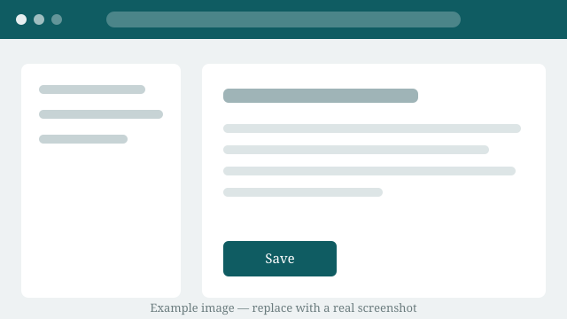

# Images and Video

Screenshots and short screen recordings are usually clearer than a paragraph of text. This page
shows how to add them.

## Where the files go

Put media in a `media` folder **beside the guide that uses it**:

```
content/appointments/
├── book-an-appointment.md
└── media/
    ├── patient-search.png
    └── booking.mp4
```

Media files are **not** listed in `manifest.json`. The site works out where they are from the
link inside the guide, so you never have to register them anywhere.

## Adding an image

Write an exclamation mark, the description in square brackets, then the path in round brackets:

```markdown

```

The text in square brackets is read aloud by screen readers, so describe what the image shows
rather than writing "screenshot". Here is a live example:



Images shrink to fit the screen, so they never push the page sideways on a phone.

## Adding a video

A video uses the same shape as a link. Either of these works:

```markdown
[Booking an appointment — 40 seconds](./media/booking.mp4)


```

The site spots the `.mp4` ending and shows a proper video player with play, pause and volume
controls, using whatever the phone or computer already has built in. The text you wrote appears
underneath as a caption.

`.mp4`, `.webm` and `.ogv` all work. `.mp4` is the safest choice — it plays on every hospital
device without extra software.

Nothing downloads until the reader presses play, so a guide with a video on it still opens
quickly on a mobile connection.

## Keeping videos usable on a ward

- **Keep them under about a minute.** Split a long process into several short recordings, one
  per section of the guide.
- **Keep the file small** — aim below 10 MB. Staff may be on 4G.
- **No sound-only information.** Wards are noisy and staff often have the volume off. Anything
  spoken in the recording must also be written in the guide.
- **Never record real patient data.** Use test data only.

## Naming media files

Lowercase letters, numbers and hyphens. `patient-search.png`, not `Patient Search (1).png`.
