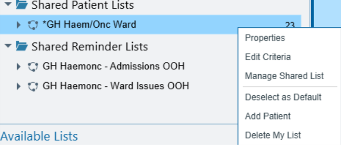
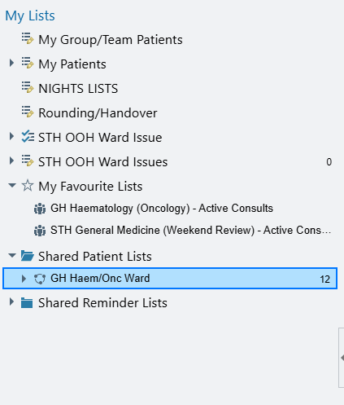
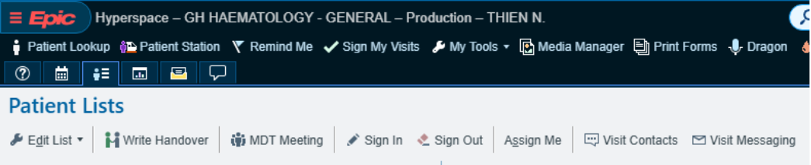
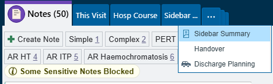
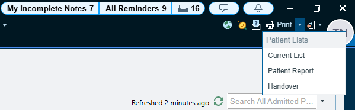
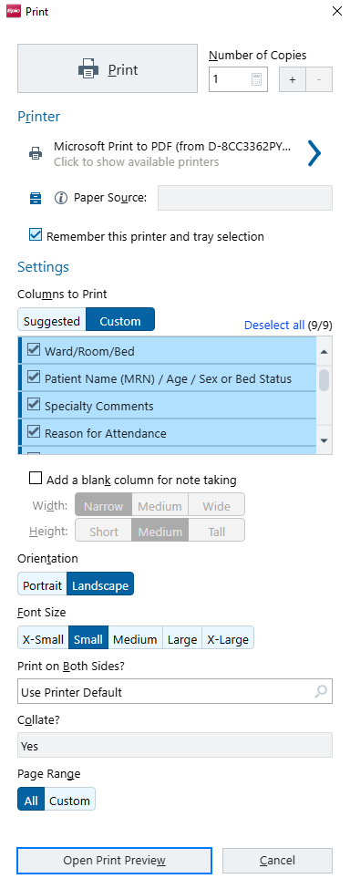

# Inpatient Ward List Guide

Welcome to the Haematology/Oncology Team at Guy’s and St Thomas Hospital. This quick guide is show you how to access and use the EPIC Inpatient Ward list and FAQ

## How to access the list

Ideally you should have been added to the ‘Shared Patient List’ on induction. If not, ask any Physician within the inpatient team to give you access to the list.

This can be done by right clicking their list and selecting **‘Properties’**. Click on the **‘Advanced’** section and add the person to the list. Select **‘View list’** option

You can find the list in the **‘Shared Patient List’** folder on the left-hand side of EPIC. If you **CAN’T** see it, then **CLOSE EPIC** and **RE-OPEN** it  

## Adding & Removing Patient

Patients are automatically added to this list once they’ve been assigned to the **‘Guy’s Clinical Haematology Team’** team. They will be removed once they’re discharged (Will say ‘Transit’ before fully discharged)

For patients who are ***TCI* “To come in”**; they can be manually added. Right click the list and select **‘Add Patient’** and add them via their MRN

## Updating the List

Someone will need to make sure the list is updated every morning. You will need to access the **‘Handover tool’** to edit the **‘Summary’** and **‘To do’**

Either select **‘Write handover’** on the top right of the list when selecting a patient OR enter their admission encounter search **‘Handover’** at the top OR you may have it on your sidebar already

**Handover Tool**

**Make sure** to select **‘Clinical Haematology’**

You can update patient information here

You can add ward jobs here, which is seen by the team, each job can be ticked off once completed

General plans can be added here and tick-boxes to check before end of day shift

## Summary

When updating the list, we tend to include the following information, an example has been shown below

- Haematological diagnosis, SACT plan/Chemotherapy, Current Cycle + Day OR Date of 1st Day of cycle
- Admission reason
- Current issue list
- Antibiotics list and dates

If there have been any issues overnight, add to summary as below. Remember to remove the following day.

*Bear in mind, when filling out the summary try not to add too many rows or copy and paste blocks of text as this will bulk out the list and make it difficult to read and to print.  A summary of the patient is all that is needed*

## To Do

Jobs during ward rounds can be added to the **‘To Do’** section. You can either add a **‘task’** which creates a check-box job or type out a job/plan in the text box. These jobs will be updated in real-time and be visible to the wider team. Tick the check-box once completed, this will remove the job for everyone else on the team

Type in here to create at tick-box job

## Printing the List

Printing the list is found on the top right whilst viewing the list

Preview the list before printing to see what it looks like and how many pages

To add a blank column on the list for note taking

If the list is too long, try smaller fonts

**Select ‘Custom’** columns and select which columns you want to print
