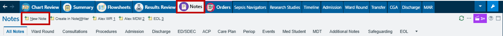
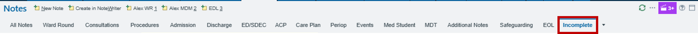
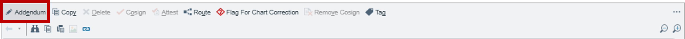

# Documenting Notes

To document for a patient, enter their encounter and select the 'Notes' tab and 'New Note'.

Select the type of note you want to make e.g. 'Ward Round', 'Progress Note', 'Patient/Family Communication' and the Speciality you're documenting for.

For some notes e.g. 'Progress note' you can 'Pend' which will save it as an 'Incomplete note' which you can sign later.

For 'Ward Round' notes you can 'Share' which will allow other people to access that note and sign later allowing you to prep ward rounds for other people.

Incompelte notes can be found in the tab. You may need to select the 'down arrow' to find it. You can edit saved notes here before signing it

You can edit signed notes by select the 'Addendum' at the top of a signed note.

