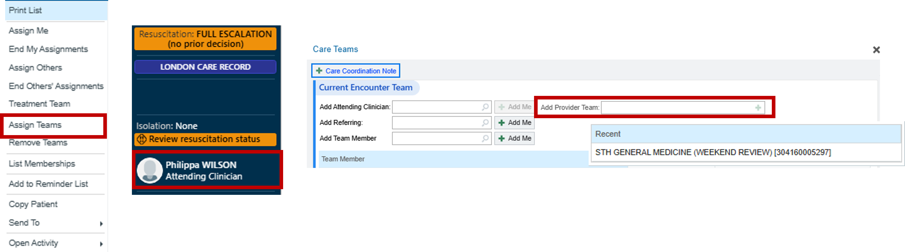
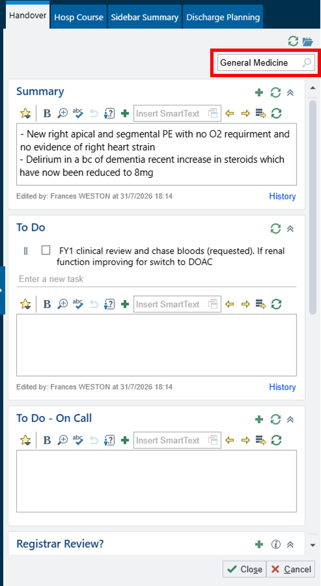

# F1 General Medicine & OPU Weekend Ward Handover

There is no in-person handover for weekend on-call team. If patient not added to weekend review list – they will **NOT BE ROUTINELY SEEN** by weekend team

This includes Night team handover to day team on Friday and Saturday night

Patients requiring weekend review should be added to the **Weekend list** with an appropriate written handover documented

To locate the Weekend list, refer to the Patient Lists section of this guide

## Adding a Patient to the Weekend List

### Option 1 – From a Patient List

1. Right-click on the patient.
2. Select **Assign Team**.
3. Choose **STH General Medicine (Weekend Review)**

### Option 2 – From the Patient's Chart

1. Open the patient's encounter.
2. Select the **Attending Clinician** field.
3. Add **Provider Team - STH General Medicine (Weekend Review)**

Ensure the written handover contains all relevant clinical information, including the current problem, outstanding tasks, escalation plan, and any anticipated overnight issues.'

> **IMPORTANT: MAKE SURE TO SELECT THE CORRECT SPECIALTY IN THE TOP RIGHT 'GENERAL MEDICINE'**

