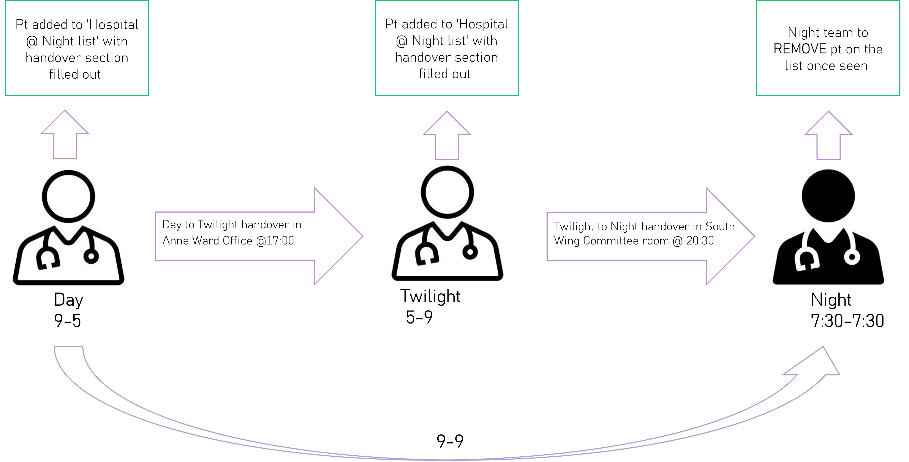
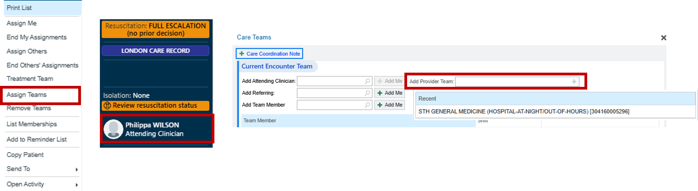
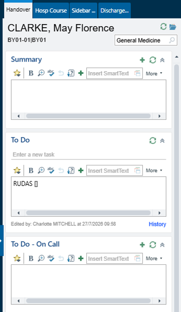

# F1 Night Medical Handover

Medical Night handover happens at **20:30** in the **South Wing Committee Room**. It is a verbal handover to the Night F1s and Night Medical SpR.

Patients requiring overnight review or ongoing management should be added to the **Hospital at Night list** before the verbal handover. This should be completed by either the Day F1 or the Twilight F1, with an appropriate written handover documented.

To locate the Hospital at Night list, refer to the Patient Lists section of this guide.

## Adding a Patient to the Hospital at Night List

### Option 1 – From a Patient List

1. Right-click on the patient.
2. Select **Assign Team**.
3. Choose **STH General Medicine (Hospital at Night)**

### Option 2 – From the Patient's Chart

1. Open the patient's encounter.
2. Select the **Attending Clinician** field.
3. Add **Provider Team - STH General Medicine (Hospital at Night)**

Before handing over, ensure the written handover contains all relevant clinical information, including the current problem, outstanding tasks, escalation plan, and any anticipated overnight issues.'

> **IMPORTANT: MAKE SURE TO SELECT THE CORRECT SPECIALTY IN THE TOP RIGHT 'GENERAL MEDICINE'**

All Urgent Imaging and Bloods out of hours must be handed over and chased by the Night team

Anyone reviewed overnight on a Friday or Saturday night who have outstanding investigations that have not been completed and reviewed by 8am the next day **MUST** be added to the weekend handover list for the following day review- if this doesn’t happen critical investigations may get missed.

## Removing Patients

Night F1 should remove patients from the Night list after completiting outstanding jobs
