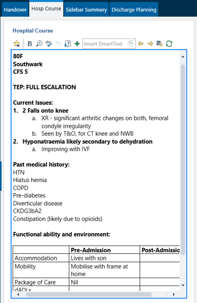

# Hospital Course

The Hospital Course provides a continuously updated summary of the patient's admission. Rather than documenting the entire admission at discharge, the Hospital Course should be updated throughout the patient's stay with significant clinical events and changes in management.

The `.hospcourse` SmartPhrase generates a template that can be used within the **Hospital Course** tab

Keeping the Hospital Course up to date has several benefits:

1. **Improves continuity of care**
   Provides a clear summary of why the patient was admitted, the key investigations and treatments undertaken, and the current management plan. Allows other members of the team to quickly understand the patient's admission without reviewing multiple notes.

2. **Supports clinical handover**
   Makes handovers, ward rounds, and patient presentations more efficient by providing a concise overview of the patient's progress.

3. **Enhances ward round documentation**
   Many ward round SmartPhrases automatically pull the Hospital Course into the note

4. **Saves time at discharge**
   The `.edlgimopu` SmartPhrase automatically populates the Hospital Course section of the discharge summary. If the Hospital Course has been maintained throughout the admission, this provides a clear and accurate admission summary with minimal additional work.

