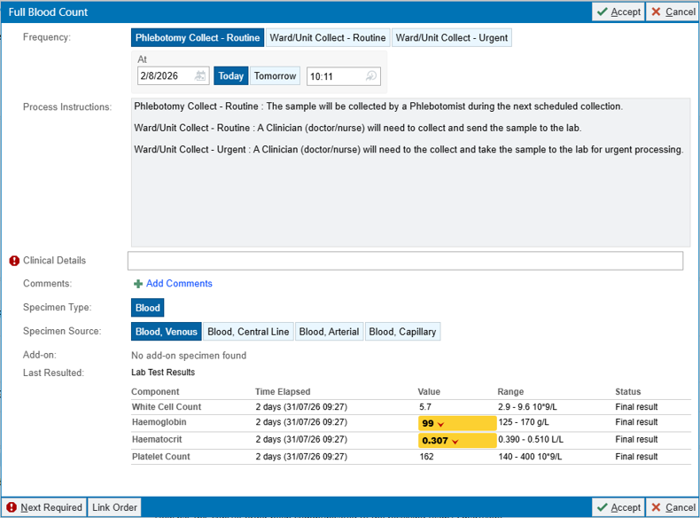
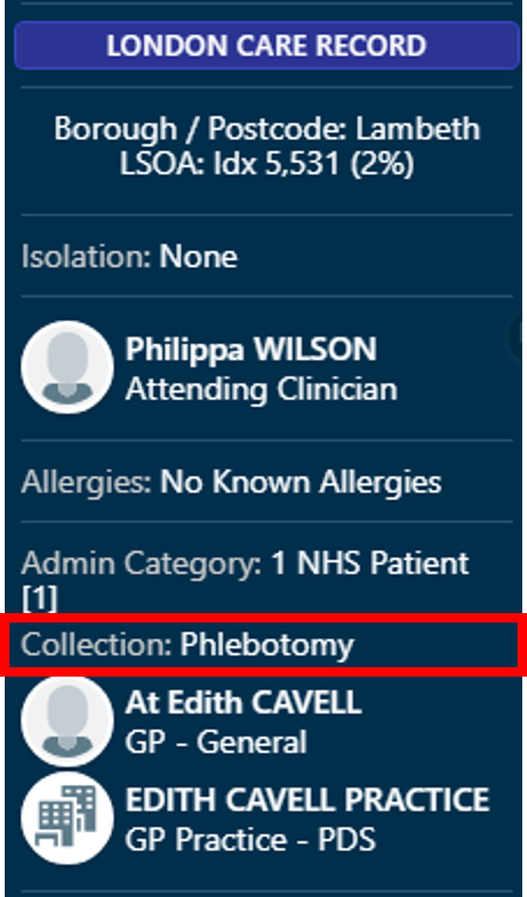
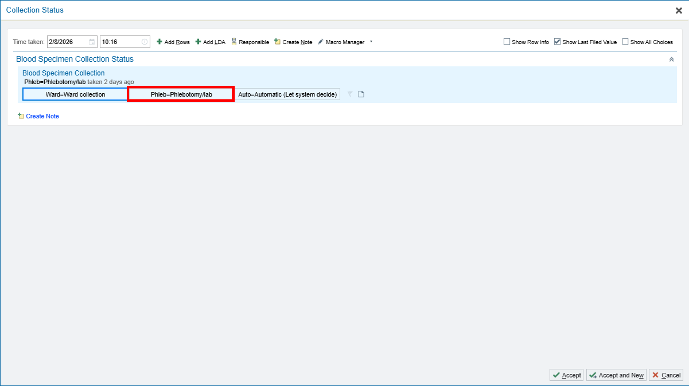
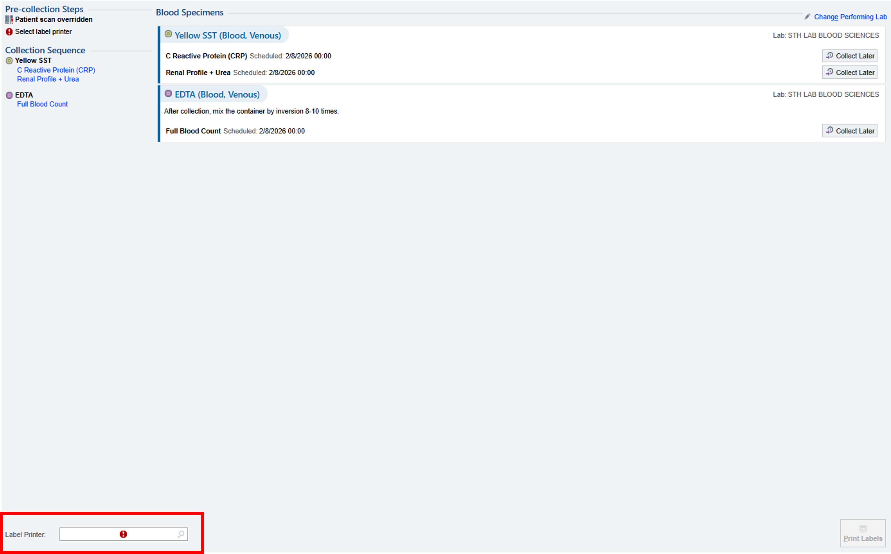
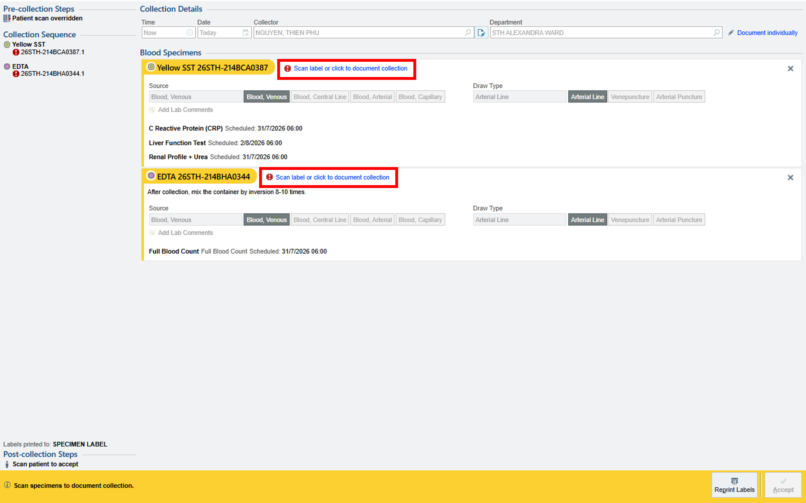
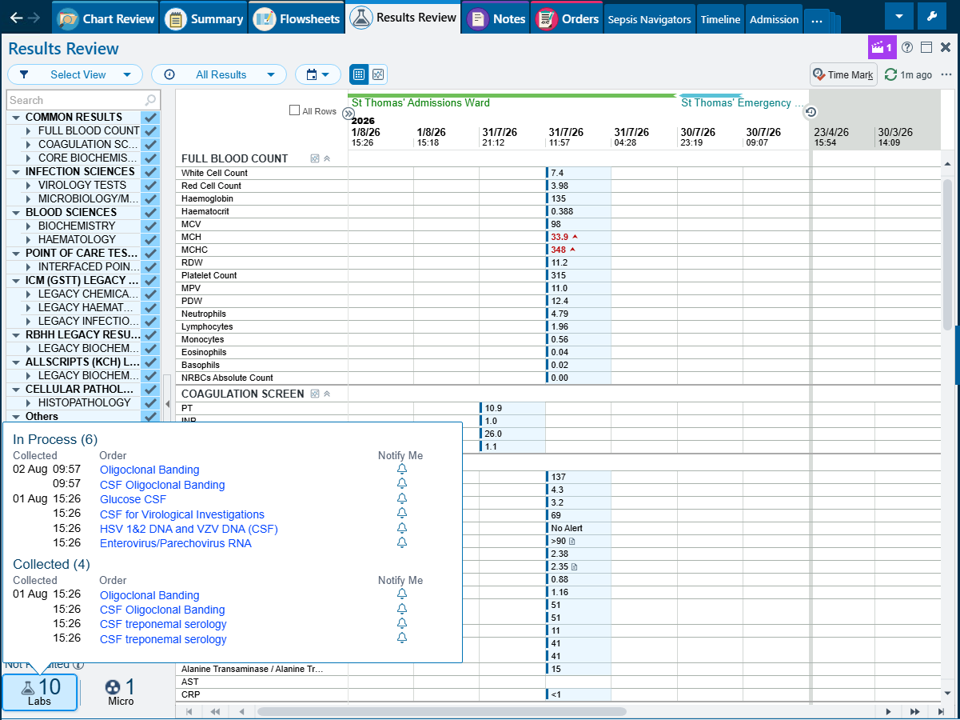

# Ordering Blood Tests

When ordering blood tests, select the appropriate option depending on when the sample will be taken

Note Phlebotomist will usually not accept any request submitted after 8:00am. Any blood tests requiring the phlebotomist should therefore be requested the day before whenever possible

## IMPORTANT - Check Collection Status

After ordering blood tests, always check the collection status. This can be found on the left-hand sidebar.

If you have ordered blood tests for the phlebotomist, you must ensure the collection status is set to **Phlebotomy**.

1. Click on **Collection Status**.
2. Select **Phlebs**.

## Printing and Collecting Blood tests

If you are collecting the blood sample yourself and need to print labels:

1. Select the **Orders** tab.
2. Click **Manage Labs**.
3. Change the **Collection Status** to **Wards**.
4. Refresh the screen.
5. Locate the blood test order and select **Collect**.

You will then be prompted to identify the patient by scanning their wristband or selecting another valid identification option.

Next:

1. Select the correct label printer for your ward.
2. Print the specimen labels.
3. Collect the blood sample.
4. Scan the specimen label to confirm collection or manually document the collection if scanning is not possible.

You can check whether a blood sample has been collected or received by the laboratory using the **Results Review** tab.

Open the **Results Review** tab.

In the bottom left-hand corner, select **Labs**.

Review the status of the requested blood tests.

The status will indicate the progress of the sample:

- **Collected:** he blood sample has been collected and the collection has been documented.
- **In Progress:** The sample has been received by the laboratory and is currently being processed.

