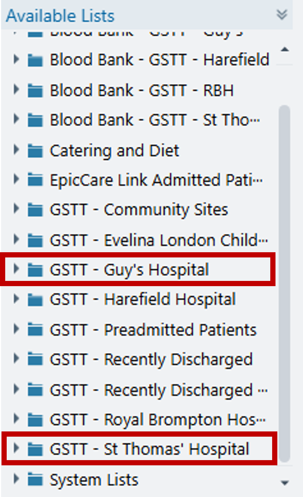
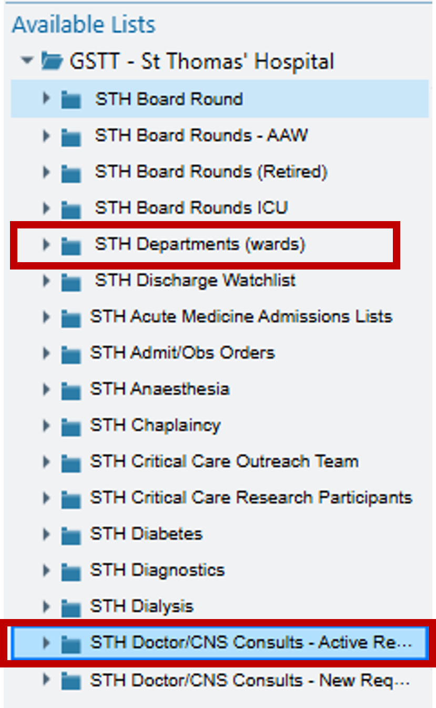
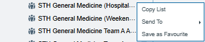

# Finding & Joining Patient Lists

## System Patient Lists

Most patient lists can be found in the 'Available lists' section under 'GSTT - Guy's Hospital' and 'GSTT - St Thomas' Hospital'

Some specialties uses the 'STH Doctor/CNS Consults - Active Requests' or 'STH Deparments (wards)'

Within the Consult list is where you can find the 'STH General Medicine (weekend review)' and 'STH General Medicine (Hospital-at-Night)' lists. You should favorite these lists by right clicking and 'Save as Favourite' to allow easier access later.

## Shared Patient Lists

Some specialties use 'Shared Patient Lists' which can't be found on the 'Available Lists'. You will need to find someone who has permission to add users to the list.

Right click the shared list and select 'Properties'. Select Advanced and scrow down the list to allow user access.

